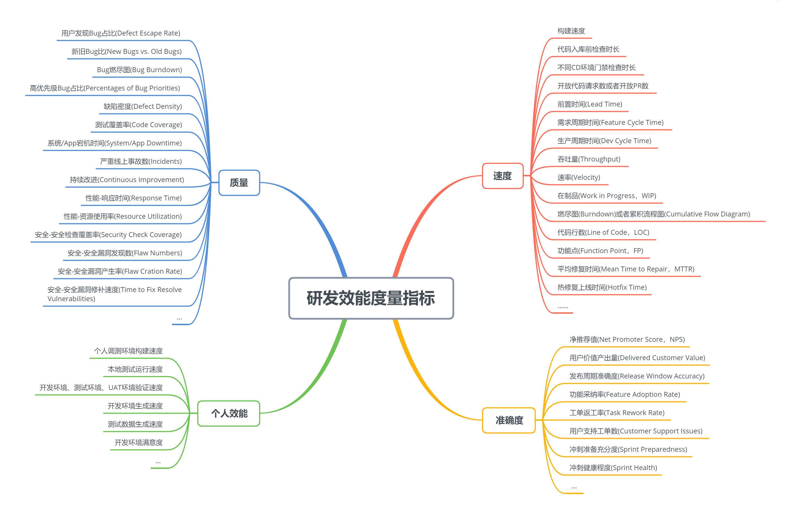

# 研发效率破局之道

### 开篇词 | 为什么你要关注研发效能？

研发效能的完整定义应该是：团队能够持续地为用户产生有效价值的效率，包括有效性（Effectiveness）、效率（Efficiency）和可持续性（Sustainability）三个方面。简单来说，就是能否长期、高效地开发出有价值的产品。

### 01 | 效能模型：如何系统地理解研发效能

优化流程、团队工程实践、个人工程实践，以及文化和管理，就是我们提高研发效能需要关注的 4 个方面，也就是我们所说的研发效能模型。

### 02 | 效能度量：效果不好甚至有副作用，怎么回事？

**研发效能度量的定义和作用**

研发效能的度量，从应用程序开发的生命周期中获取数据，并使用这些数据来衡量软件开发人员的工作效率。我们希望通过这样的度量，能够根据客观的数据而不是个人的主观意见去决策，从而实现以下几点：

跟踪团队的表现、提高团队的绩效。

提高项目计划的精确度。

了解流程是否高效，寻找需要改进的关键领域。

**效能度量被大量误用，问题究竟出在哪儿？**

研发效能难以度量的最根本原因在于，软件开发工作是一项创造性很强的知识性工作，非常复杂且伴随有大量不确定因素。

面对这样的一个复杂系统，我们不可能覆盖其全部参数。而如果这时，研发人员的利益和这个度量结果相关，那么他就很可能会通过"做数字"来欺骗度量系统。

研发效能难以度量的第二个原因，很多公司有竖井（silo）存在，所以常常会把注意力放到某一两个竖井上，进行局部优化。但是，局部优化并不代表全局优化，甚至会让全局恶化。

研发效能难以度量的第三个原因在于，度量指标一般用来度量软件产品的生产过程和产品质量，但是公司真正需要关注的是产品能否解决用户问题，也就是说能否产生用户价值。技术产品输出和用户价值输出之间的沟壑难以打通。

### 03 | 效能度量：如何选对指标与方法，真正提升效能？

**效能度量的指标分类**

速度：天下武功，唯快不破，速度指标主要用来衡量团队研发产品的速率。

准确度：关注产品是否跟计划吻合，跟用户需求吻合，能否提供较大的用户价值。

质量：如果质量有问题，产品的商业价值会被大打折扣。

个人效能：个人开发过程中的效率指标。



**效能度量的原则**

效能度量不要与绩效挂钩，而应该作为参考和工具，帮助团队提高效能。

**效能度量的推荐方法**

*目标驱动，度量对的事*

提供用户价值是公司存在的根本，因此与之相关的指标是最最重要的。

净推荐值（Net Promoter Score，NPS）、系统 / App 宕机时间（System / App Downtime）和严重线上事故数（Incidents）、热修复上线时间（Hotfix Time）

*先从全局上找瓶颈，再深入细节*

累积流程图（Cumulative Flow Diagram）

*通过主观的方式来评价、提高效能*

针对研发环境、流程、工具的效能进行评价，可以使用公司成员对研发效能满意度的净推荐值。

针对个人研发效能作评价，可以采用类似 360 度绩效考评的方式来收集同事之间的评价。评价的标准基于在用户价值输出上做出的贡献，包括自身产生的价值，以及帮助团队成员产生的用户价值。

*关注个人维度的指标提高效能*

一般来说，"个人调测环境构建速度"是一个比较重要的指标。它描述的是开发人员在本地做好一个改动，到能够进行本地调测的时长。

### 04 | 流程优化：怎样才能让敏捷、精益真正为我所用？

**如何实践方法论？**

Why-How-What 黄金圈法则。

最中间的一个圆是 Why，也就是这个方法论的目标，是要解决一个什么问题；第二个圆是 How，也就是这个方法论的基本原则、指导思想；最外层的圆是 What，也就是这个方法论的具体实践。

我们必须首先深入理解这个方法论的目标和基本原则，然后根据原则因地制宜地选择具体实践。

在引入实践的时候，我的建议是逐步优化已有的开发流程和框架，甚至只给出原则，让团队成员逐步摸索并最终找到合适的方法。

**目标一：寻找用户价值**

优化研发流程的第一步，就是提高寻找用户价值的效率。

第一条原则是：衡量每一个时间段成果的标准，应该是价值假设方面的进展。也就是说，你的工作应该让你学习到如何更好地给用户提供价值，而不是开发了多少功能。

第二条原则是：使用最小可行性产品（Minium Viable Product，MVP）来帮助学习。这里的关键点是，要以探索价值为出发点设计产品，最快地验证你的假设，功能要尽量少，能够使用就可以。

**目标二：提高用户价值的流动效率**

第一，让功能尽快地流动，说白了就是快速开发。

要做到快速开发，开发人员需要尽量把功能拆分，同时做好一个提交之后尽快提交。要做到这一点，关键原则是降低提交的交易成本（Transaction Cost）。

第二，让节点之间的联动更加顺畅，可以通过对关键流程的自动化、工具之间的网状互联，以及节点之间的融合来实现。

第三，节点间的融合，也是为了保证节点间的联动顺畅。

在这一方面，我见到比较有效的方式是：职能团队提供平台和工具，让全栈工程师能够自己处理端到端的工作。

第四，发现整个流程中的瓶颈，并解决它们。

具体的实践有可视化和复盘。

### 05 | 代码入库前：Facebook 如何让开发人员聚焦于开发？

**规范化、自动化核心步骤**

要让开发者聚焦于开发，就必须把研发流程中可以自动化的步骤尽量自动化。

*提高开发环境的获取效率*

有一个可以采用的优化方式是，把整个开发环境的获取，进行服务化、自助化。也就是说，开发者可以自助地申请获取环境，不需要 IT 部门的人员介入，从而既节省了开发者的时间，又降低了 IT 部门的人力成本。

第一种方式，借助基础设施即代码（Infrastructure as Code，IaC）系统。

第二种方式，提供机器镜像和配置脚本。

*规范化、自动化化本地检查*

我推荐的方式是，根据团队实际情况，找到合适的工具和配置进行这些检查，并让团队成员统一使用。

*建设并自动化代码入库前的检查流程*

这个流程一般可以使用代码仓管理系统作为中心，直接使用或者通过钩子集成其他工具和系统来实现。比如，使用 GitLab 提供的 GitLab CI/CD 框架。

**提供快速反馈，促进增量开发**

*灵活使用各种 Linter 和测试*

*建设并优化沙盒环境*

*使用实时检验工具*

[Overview of Spring Boot Dev Tools](https://www.baeldung.com/spring-boot-devtools)

### 06 | 代码入库到产品上线：Facebook 如何使用 CI/CD 满足业务要求？

**3 个"持续"的定义和作用**

持续集成的定义就是：在团队协作中，一天内多次将所有开发人员的代码合并入同一条主干。

持续交付的目标是，对每一个进入主干分支的代码提交，构建打包成为可以发布的产品。它的定义是：一种软件工程方法，在短周期内完成软件产品，以保证软件保持在随时可以发布的状态。

而持续部署，则更进一步。它把持续交付产生的产品立即自动部署给用户，定义就是：将每一个代码提交，都构建出产品直接部署给用户使用。

它们共同的本质是，让每一个变更都经过一条自动化的检验流水线，来检查每一个变更的质量，通过就进入下一个阶段。

**CI/CD 流水线的具体原则以及最佳实践**

*流水线的测试要尽量完整*

最主要的工程实践，就是在流水线中运行大量高质量的测试和检查。

*流水线的运行速度一定要快*

从技术角度考虑：

使用并行方式运行各种测试来提速；

投入硬件资源，使用水平扩展的方式来提速；

使用增量测试的方式进行精准验证。也就是说，只运行跟当前改动最相关的测试，以减少测试用例的运行数量。

权衡流水线的运行速度、流水线资源和测试完整性的关系：

如果通过增加硬件资源来提升运行速度需要的成本太高的话，可以对测试用例按优先级进行分类，每天运行流水线的时候，不用每次都运行所有测试用例，只选择其中几次进行全量测试。

提供支持，让开发人员在本地也能运行这些测试，从而使用本地资源尽早发现问题，这就避免了一些有问题的提交占用流水线的资源，进而提高整条流水线的运行速度。

运行测试的时候，按照一定的顺序运行测试用例。比如可以先运行速度快的用例，以及历史上容易发现问题的用例。这样可以尽早发现问题，避免耗费不必要的资源。

*流水线使用的环境，尽量和生产环境一致*

软件包最好只构建一次，保证各种不同环境都用同一个包。如果不同的运行环境需要不同的参数，可以采用环境变量的方式把这些参数传递给软件包。

使用 Docker 镜像的方式，把发布的产品以及环境都打包进去，实现环境的一致性。

**具体案例：Facebook 是如何实施 CI/CD 来提高效能的？**

不针对每一个提交进行 CD 验证，而是按照一定时间间隔进行验证。

对验证进行分级。也就是说，有几条不同的 CD 流水线，按照不同的时间间隔运行构建和检验。根据运行时间间隔的不同，它们运行的检验数量以及检查出来的 Bug 优先级也不同。

### 07 | 分支管理：Facebook 的策略，适合我的团队吗？

**Facebook 的分支管理和发布策略**

*开发分支*

所有的开发人员基于 master 分支进行开发（禁止功能分支），提交也直接 push 到这个分支上。

```bash
git checkout master

git fetch
git rebase origin/master
git rebase --continue

git push
```

问题：如果需要多人协同一个较大的功能，怎么办？

解决办法：这种情况下，Facebook 采用的是使用代码原子性、功能开关、API 版本等方法，让开发人员把功能拆小尽快合并到 master 分支。

*发布分支*

在需要发布的时候会从 master 拉出一条发布分支，进行测试、稳定。在发布分支发现问题后，先在 master 上修复，然后 cherry-pick 到发布分支上。

*周部署*

```bash
git checkout -b release-date-* origin/master
git cherry-pick <commit ID>
```

*日部署 / 热修复部署*

```bash
git checkout -b hotfix-date-* release-date-*
git cherry-pick <commit ID>
```

**Facebook 分支管理策略的背后原因**

能够促进开发人员把代码频繁入主仓进行集成检验。而这，正是持续集成的精髓。

能够确保线性的代码提交历史，给流程自动化提供最大方便。不要小看"线性"，它对自动化定位问题意义非凡，使得我们可以从当前有问题的提交回溯，找到历史上第一个有问题的提交。更棒的是，我们还可以使用折半查找（也叫作二分查找）的办法，用 O(LogN) 的时间找到那个有问题的提交。

**其他主要分支方式**

*Git-flow*

Git-flow 工作流的特点是规定很清晰，对各种开发任务都有明确的规定和步骤。

但缺点是：

流程复杂，学习成本高；

容易出错，容易出现忘记合并到某个分支的情况；

不方便进行持续集成；

有太多的代码分支合并，解决冲突成本比较高。

*Fork-merge*

它提供了一种对主分支更严格、更方便的权限管理方式，即只有主仓管理者有权限推送代码。

这种方式对开源项目比较方便，但缺点是步骤繁琐，不太适用于公司内部。

**哪一种分支管理策略更适合我的团队呢？**

尽量减少长期分支的数量，代码尽早合并回主仓，方便使用 CI/CD 等方法保证主仓代码提交的质量，是选择分支策略的基本出发点。

### 08 | DevOps、SRE 的共性：应用全栈思路打通开发和运维

**DevOps 和 SRE 的定义和异同**

DevOps 是打通开发和运维的文化和惯例，而 SRE 是 DevOps 的具体实践之一。说到相同点，它们都是为了打通 Dev 和 Ops，提高研发效能；说到区别，DevOps 是文化，而 SRE 是职位。

**DevOps 和 SRE 的 Why、How、What**

DevOps 和 SRE 最初要解决的问题：开发和运维这两个角色的目标不一致，导致研发和上线流程的不顺畅，最终严重影响软件上线的效率。比如，运维团队倾向设置多而严格的上线检查门禁，限制上线频率。而开发人员则很可能把一些功能"伪装"成 Bug 修复，来绕过针对版本发布的严格检查。

*原则 1：协调运维和开发人员的目标、利益*

实现这个原则的一个最主要的方法，我称之为"全栈开发"。

对产品结果负责，而不是只对某一个具体环节负责。

第一，增加一个新的运维角色，用开发的方式去做运维。

他们会被指派到具体的产品团队中，深入到开发第一线，拿出比较多的时间进行编程工作，针对性地自动化和优化 CI/CD 中的流程、工具等。

类 SRE 顺利推进的关键是，找到高质量的开发、运维多面手，也就是有很强的开发能力，同时有系统维护、网络问题排查等运维技能的工程师。

第二，修改开发人员的职责描述为，快速开发和上线稳定的高质量产品，让他们也参与到一部分运维工作中去。

*原则 2：推动高效沟通*

*原则 3：优化从开发到部署的整个上线流程*

**落地步骤推荐**

DevOps 的本质是解决开发和运维之间的冲突，所以落地时首先要从人出发，然后是流程，最后才是工具。

### 09 | 信息流通：让团队高效协同，让产品准确击中目标

**团队成员愿意共享是有效沟通的前提**

首先，要让团队成员了解信息沟通的重要性。

更重要的是，我们要在团队内部建设机制，来鼓励共享的行为，从而形成共享的文化。

简单来说，就是让信息共享和每个成员的利益紧密联系起来。

一个比较有效的解决办法是，按照产品或者功能划分团队，让团队成员直接对产品或者功能负责。

但是，改变公司的组织架构往往阻力大、推进缓慢。去解决按照职能划分团队的沟通问题，一个比较有效的办法是，使用虚拟团队。

**设计流程和使用工具，推动研发信息高效沟通**

*战略目标相关的信息*

尽量公开。只有当团队成员清楚公司以及团队目标时，才能更容易把自己的目标与之对齐。或许，这就是 OKR 最近几年特别流行的原因吧。

*代码相关的信息*

尽量公开。代码是最直接的参考，是最实时的文档。

*研发过程中用到的各种文档*

绝大部分团队主要使用公司统一的 Wiki 来进行松散的文档管理，既方便添加、修改，也方便搜索。

*各种标识信息*

管理这一类信息的有效方法是，各种工具通过提供 API，做到服务化，形成工具之间的网状连接，以方便开发人员在工具上快速拿到需要的各种信息。

**沟通方式技巧**

高效沟通的首要原则就是，根据沟通需要达成的任务的实时性、方便追溯性，以及对别人的干扰程度，选择合适的沟通工具。
